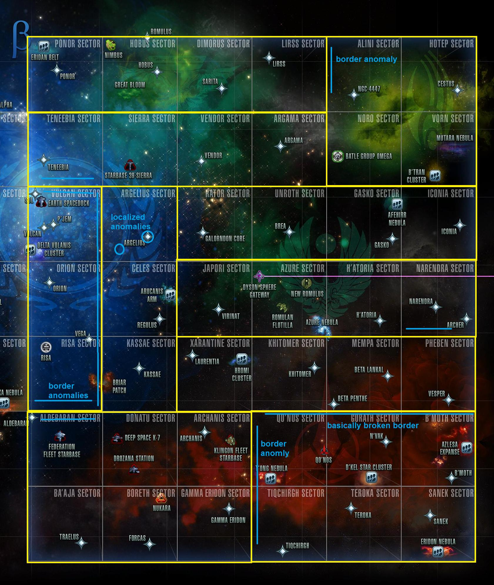
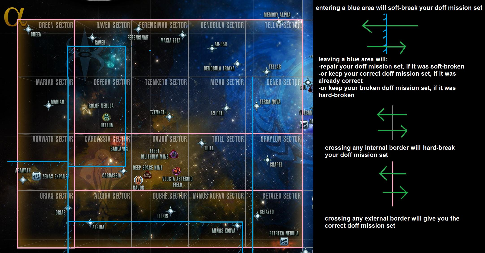

# Getting Started with Doffing

[//]: # vim:wrap

## Abbreviations
	ESD		Earth Spacedock
	SFA		Starfleet Academy
	Fed		Federation-aligned
	KDF		Klingon Defense Force-aligned
	FC		Fleet Credits
	EC		Energy Credits
	D		Refined Dilithium
	Z		Zen

## Prerequisites
1. Read the wiki: https://sto.fandom.com/wiki/Duty_officer	
You can't start until level 11.

2. Join a 
[Fleet](https://sto.fandom.com/wiki/Fleet).
You'll need to be in a fleet to donate your excess common doffs for 
[Fleet Credits](https://sto.fandom.com/wiki/Fleet_Credit),
and you will have a lot of excess to get rid of.
You'll want a fleet with reasonable access to buying at fleet stores, and one that has a full and active
[Armada](https://sto.fandom.com/wiki/Fleet#Fleet_Armadas)
so you have a variety of Contribution possibilities.

3. Make some coin (EC) and get stocked.  You should have at least a couple hundred thousand EC to buy supplies, etc without breaking the bank.  If you're a 
[Recruit](https://sto.fandom.com/wiki/Recruitment_event)
(Temporal/Delta/etc), completing the Klingon War chain will get you 2.5 million and you'll be rolling.  Then go stock up on the main Commodities.
(See [Commodities](#commodities) below).

4. Get set up with [DOFFTrekker](http://bit.ly/DOFFTREKKER3).
Once you get going, it can be frustrating to find the assignments you need
and deal with the cooldowns.  This Google Docs spreadsheet makes it easy.
The [DOFF viewscreens](http://bit.ly/DOFFS)
no longer seem to be actively updated, but for cooldown management it still works great.   If you don't want to use a Google account, you'll need some other way of recording cooldowns for each of the many assignments, or you'll waste a lot of time flying around sector space looking for assignments that are guaranteed not to be there.

When starting out your main focus should be on building your doff roster of blues and purples.  There's not much point to running the more valuable assignments until you have a much better chance of success/crit, and doff 
[quality](https://sto.fandom.com/wiki/Quality)
is the most important attribute in determining success/crit.

## The Basic Cycle of Assignments

To start with, you'll get the bulk of your blue and purples from the repeatable Asylum assignments
along with some one-time rewards from completing chains.

The basic cycle of assignments with their cooldowns (CD) goes like this:
|assignment										|duration|cooldown| purpose
|----------										|-------:|-------:| -----------
|[R&D Research Projects](#rnd)					|20h	|none	| to level your R&D Crafting
|[SFA Personnel Cadres](#cadre) (4)				|?		|96h	| to give whites for grinding 
|[SFA Cultural Exchange](#cultural) (3)			|?		|68h	| to give whites for grinding.
|[Resettle Colonists](#resettle)				|4h		|28h	| to give Colonists for the Colonization Chain.
|[Colonization Chain](#colonization) 1-7		|20h	|none	| to unlock the Resupply assignments
|[Colonization Resupply](#resupply)				|4h		|28h	| to give you Refugees for Asylums
|[Asylums](#asylum)								|20h	|44h	| to give you blues/purples)
|[Consular Chain](#consular) 1-4				|varies	|none	| to unlock Consular Exchange
|[Consular Exchange](#exchange)					|varies	|none	| to exchange your greens/blues/purples

NB: All cooldowns are taken from the START of the assignment.

It is tempting to buy greens from
[Lt. Ferra](https://sto.fandom.com/wiki/Ferra),
but beware that those are 
[ungrindable](#grinding)
(but can be
[Exchanged](#exchange))

## Doff Roster and Culling
You'll start out with 100 Roster slots and there are 47 main 
[Specializations](https://sto.fandom.com/wiki/Duty_officer#Specializations),
so two of each is a nice round number to start with, and you'll need 3-6 Research Lab Specialists for 
[R&D](https://sto.fandom.com/wiki/Research_and_Development)
leveling (as many as you have R&D slots unlocked), and room for a couple of transient 
[Refugees](https://sto.fandom.com/wiki/Specialization:_Refugee).

Until you get at least greens in each Specialization, you will have to be selective about which whites you want to keep (for assignments) and which you can grind (see [Grinding](#grinding) below).
I found the best way to do that is just use the Roster's Specialization filter one-by-one and look at how many doffs there are.  You can still make out the doff quality by the icon border while the pop-up menu is obscuring
most of the panel.
When you see a Specialization with more than 2 doffs, open your Armada or Personnel Officer to grind the excess away. The exceptions are the 3-5 Research Lab Specialists and any Refugees which you'll need for Asylum assignments.

This can be a bit of a pain and you'll often end up with doffs in your inventory overflow (you can "Take All" to remove the ones that fit) and you'll need repeat cullings to get rid of any new ones you downgrind.

Note that doffs only can go into your Roster, not into your inventory.  Any that do not fit will go into your inventory 
[Overflow](https://sto.fandom.com/wiki/Inventory#Overflow_Bag)
(up to a max of 50 total overflow items).  The 
[Unbound](https://sto.fandom.com/wiki/Bound)
ones can be dragged from the Roster or Overflow into 
[Mail](https://sto.fandom.com/wiki/Mail)
or the 
[Exchange](https://sto.fandom.com/wiki/Exchange)
and grinding whites at Fleet can also take from the Overflow (but not the Personnel Officer).

Once you have at least all greens, you can bulk-grind whites without looking at them, so that is an important secondary goal.

## Grinding and Ungrindable Doffs {#grinding}
This isn't the usual sense of grinding, but rather about grinding up unwanted doffs to produce for other (better or worse) doffs or fleet credits.  (If that sounds grim, it's just a metaphor for e.g. sending 5 substandard doffs into workaday meat-grinder missions in exchange for a better 5X employee).

There are several ways of grinding unwanted doffs:

###	1. Fleet donations of Common (white) doffs.
Starbases need a lot of duty officers grinding away to keep them operational,
and you'll be donating a lot of whites for that. You get 300 FC for each one (if you choose the correct donation).

To do this, open your Fleet panel and the Armada tab and the Holdings subtab.
Select a Fleet from the Armada on the left side and open a Holding to see if there are any active Projects with doff Contributions that aren't yet filled up.  Yellow projects often have Engineering and Operations, red Tactical and Security, blue Science and Medical (but not always!), and sadly the Dilithium Mine for Civilians.
There are also generic "Common Duty Officer" contributions, but they only award 250 FC rather than 300, so leave them as a last resort.

XXX Bulk Grinding whites

### 2. Downgrinding ("Exchange Officers" - SFA Personnel Officer)
This is one way to get rid of greens/blues/purples you no longer want.  You get 3 of the lesser quality, free and immediately.
	https://sto.fandom.com/wiki/Personnel_Officer_%28Starfleet_Academy%29

The other option is to exchange them via a [Consular Exchange](#consular).

### 3. Upgrinding ("Reassignment" - SFA Personnel Officer)
This converts 5 of your unwanted doffs plus some dilithium for one of the next higher quality.   It is not usually worth the cost in lost Fleet Credits.

### Ungrindable Doffs
Some of your doffs will not be available for grinding.   This is *not* related to the 
[Bound](https://sto.fandom.com/wiki/Bound)
status (Bound-to-Character lock icon), but is an invisible trait.   It can often (but not always) be determined by the presence of a quote at the bottom of its Dossier.

These are ones I've found to be ungrindable:
- Emergency R&D Holograms granted at level 15 or Replicated.
- doffs awarded by 
	[Recruit rewards](https://sto.fandom.com/wiki/Temporal_Agent_Recruitment#Duty_officers)
	(Temporal/Delta/etc).
- Any awarded or purchased from [Lt. Ferra's store](https://sto.fandom.com/wiki/Ferra)
- Any granted as part of a promo from the C-Store (e.g. Lower Decks)
- Bonus packs granted at levels 18, 23, 31, and 41 (XXX: maybe not)
- Blues awarded by the final "Renown" mission of a Colonization chain XXX.

Ungrindable doffs can still be disposed of usefully via the 
[Consular Exchange](#consular) assignments.  Ungrindable whites can only be Dismissed.

## Sector Blocks {#sectors}

Sector 
[assignments](https://sto.fandom.com/wiki/Assignment)
appear under the Current Map tab while in sector space (and also some may appear under Department Heads > Operations).

It can be frustrating to find the assignments you want.  It may seem flaky but it is in fact fairly predictable if byzantine.

Sector assignments are grouped by 
[Sector Blocks](https://sto.fandom.com/wiki/Sector_block)
which are a vestigal grouping of sectors that were removed from the game long ago, but still determine which sector assignments appear.

Unfortunately when they were removed, sectors were rearranged and misaligned with the old sector blocks with the result that it can be frustrating to get the true sector assignments to appear.

### Default Mystery assignments
When you didn't arrive in the correct manner, the Current Map assignments will be a default "mystery" set instead of the true sector assignments.  There seem to be two possibilities denoted by their top-most assignment:

1. "Scan Particle Geyser for Methogenic Particles"
2. "Purchase Prototype Heavy Phaser Turret"

If you see either of those at the top of your Current Map, you likely don't have the true sector assignments.
The true sector assignments will have missions (Military, Espionage, etc) that reference local systems in the Sector Block.

Things that will cause the default mystery assignments to appear instead of the true sector assignments:
- crossing a sector boundary within a Sector Block
- entering a sector by leaving a system 
- entering a sector by leaving a quadrant
- entering a sector by transwarping
- crossing invisible "border anomalies"

### Getting the True Sector Assignments
The true sector assignments will only appear when entering a Sector Block by travelling across the Sector Block border, and then often only for a few light-years of travel before you hit an invisible "border anomaly" which will reset the assignments back to the default. (In particular, the Qo'noS sector block assignments only appear in a very narrow strip on its western edge).

The best approach is to enter the Sector Block slowly (at minimum speed) and stop immediately when you see the sector notification.
Remember to also check your Department Heads > Operations assignments.

This weirdness has been 
[mapped](https://www.reddit.com/r/sto/comments/3pdjod/mapping_sector_space_current_map_doff_missions/)
to some extent.  The maps with the Sector Blocks and border anomalies (blue lines) are reproduced here:
#### Beta Quadrant:
Sector Block boundaries marked in yellow:

#### Alpha Quadrant:
Sector Block boundaries marked in pink:

## The Assignments

### General Notes
- Sometimes assignments will appear under the Department Head assignments instead of the Current Map,
so you'll always need to check there as well as the Current Map.
NB: Which department depends on the specific assignment. See the assignment's description in the wiki. 

- Some assignments have 100% Success regardless of the doffs.  Don't use the default assigned doffs; select your lowest-quality doffs for those and reserve the higher-quality doffs for where it matters.   Keep an eye on the success chance though; you may need to assign one or two higher-quality doffs to keep it at 100%).

### R&D Research Projects{#rnd}
Once you hit level 15, you'll unlock R&D.  You should do your Research Projects daily to level up your schools.   The Research Project is the bottom assignment in each school, can be repeated every 20h, and gives 5000 or 6000 of Research XP.  You can do up to 3 Research Projects per school each day (but you'll need to unlock the slots).

Your first focus will be on unlocking 3 R&D slots. See the R&D Progress tab for unlock requirement (they go pretty quickly).   If you are a Recruit (Temporal/Delta/etc), be aware that you will soon get a Token to level up a school instantly to level 10:
	https://sto.fandom.com/wiki/Temporal_Agent_Recruitment#R.26D
so leave your most desireable school (e.g. Engineering or Beams) for
that token and start your leveling in your second-most desireable school.
Don't bother crafting any items until you're at least level 5 in that school with a decent crit chance.

You'll need a small supply of the common R&D Materials which you can get from Scanning during missions (or often cheaply on the Exchange), and some Research Lab Scientist doffs. (You'll need at least 3 of them to start and 6 later on).

### Colonization Chain
https://sto.fandom.com/wiki/Assignment_chain:_Colonization

Completing this chain awards a Blue and then a Purple (from the same specialization), but more importantly, unlocks a repeatable assignment
that rewards a Refugee which you'll need for the Asylum assignments.

Before you start on the chain, you'll want to stock up on Commodities:
It's probably best
	.......XXXX....
	Best Prices

To start a chain, travel in Sector Space to a node (which has a distinctive Duty Officer icon on the map).  The nearest one to Sol is the Delta Volanis Cluster.
The chain starts with the "Colony Site Survey in the <node>" assignment.
If it doesn't appear, you may have to wait for the next Sector Update (shown on the left side of the panel).
(See Assignment Sectors, Reset times, and Cooldowns below).
	
It'll take a week or so to complete the chain for each node and there are 14 nodes, so look at the wiki to see which blue/purples you want to get first.
The final (7/7) "Renown" assignment awards the blue doffs:
	https://sto.fandom.com/wiki/Assignment:_Renown

The unlocked repeatable assignment awards a Refugee (and a purple on crit):
"Support Colonization Efforts in <node>" [Fed version]
	https://sto.fandom.com/wiki/Assignment:_Support_Colonization_Efforts

For each node, the blue and purples are of the same Specialization, except for Arucanis Arm Cluster which for some reason gives a second (ungrindable!)  blue Astrometrics Scientist: Helna.  (All the others are grindable).

NOTES:
	- You don't have to succeed at an assignment to unlock the next one in the chain.
	- You get repeat purples on crit and they are grindable so this can be a good source of blues.

### Resettle Colonists
	A limiting factor for the Colonization chain is getting enough 

### Asylum assignments
	- 
Once the chain is complete, you'll unlock the 
	2.  The "Resupply" assignment will reward Refugees which are needed for the Asylum assignments

### Consular Chain

Here are the assignments you should focus on:
	1.  R&D.   Always do your R&D 

You will start out with an set of default common doffs and will get more as you level up.   Note that these doffs have an unusual hidden trait:  they can 

There is a set of synergistic assignments that you'll be focussing on.

## Commodities {#commodities}
Here is where to go for the best prices and enough quantities to get started.  You'll need to replenish (especially Provisions) regularly:

|count	|commodity						|price ea		|total
|-----:	|---------						|--------:		|-----:
||**Vulcan Sector: Andoria [Taryss]** |
|250	|Provisions						| 75			|18,750
|20		|Communication Arrays			|150			| 3,000
||**Vulcan Sector: Vulcan [Semek]**
250		|Medical Supplies				| 75			|18,750
30		|Industrial Energy Cells		|300			| 9,000
||**Fleet Embassy console [shuttle at Fleet Starbase transporter room]**
|80		|Self-Sealing Stem Bolts		|600			|48,000
|20		|Warp Coils						|600			|12,000
|10		|Industrial Replicators			|600			| 6,000
|10		|Seismic Stabilizers			|750			| 7,500
|10		|Entertainment Provisions		|600			| 6,000
|10		|Terraforming Systems			|900			| 9,000
||**Earth Spacedock Commodities [Fhoss]**
|250	|Shield Generators				| 75			|18,750
||**Sierra Sector: Starbase 39 [Commodities Broker]**
|10		|Astrometric Probes				|400			| 4,000
|10		|Antigens						|400			| 4,000
|10		|Water Purification Systems		|300			| 3,000
|10		|Weather Control Systems		|600			| 6,000
|		|TOTAL							|				|173,750

